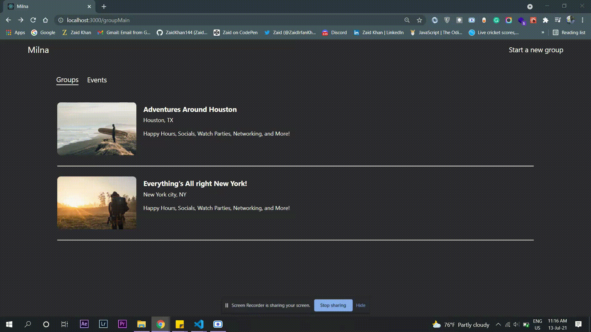
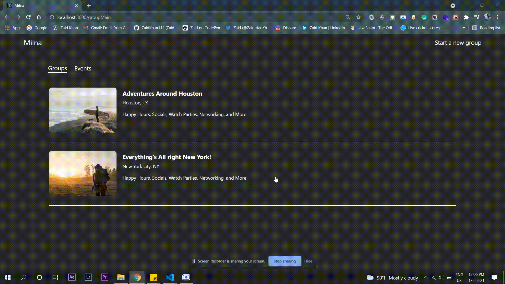

## Milna

An app for arranging online groups that host in-person or virtual events for people with similar interests.

## Project Status
This project is currently in development phase. 

## Read 

## Create

## Tech used
- Node.js
- Express
- MongoDB
- RESTful APIs
- dotenv
- ESLint - A linter tool to standardize code
- Prettier - Code formatter
